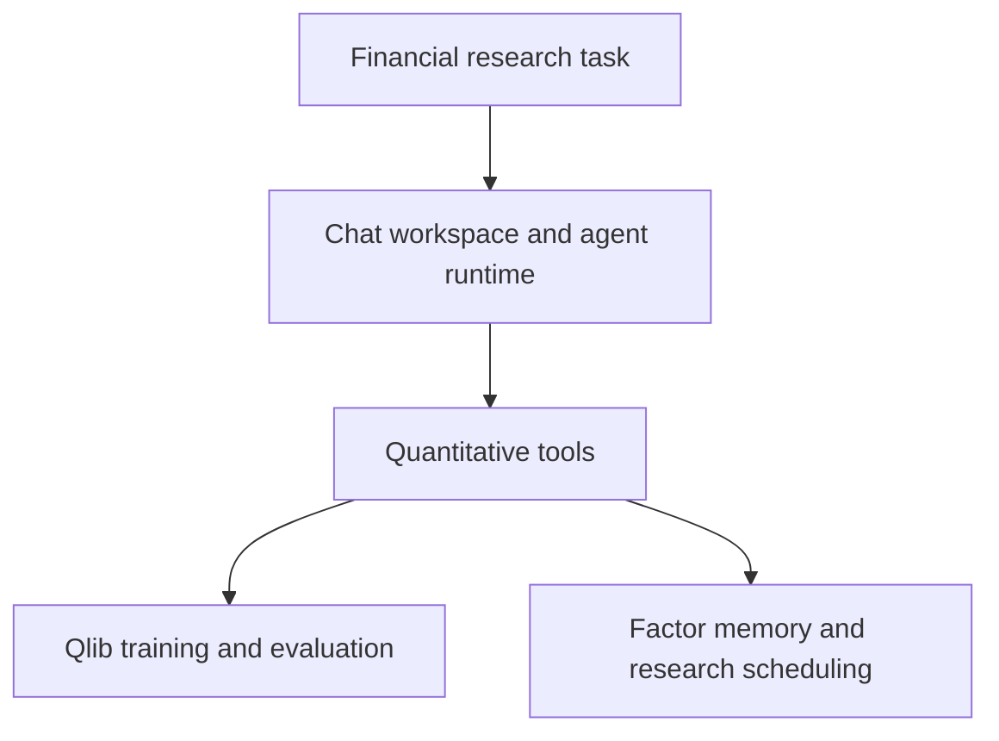

# BenjaminAgent

**A research workspace for turning financial questions into traceable factor experiments.**

[中文](README_zh.md) · [Start here](docs/en/learning-path.md) · [Run locally](docs/en/run-guide.md) · [Contribute](CONTRIBUTING.md)

BenjaminAgent connects a streaming research interface, a LangGraph agent runtime, Qlib evaluation, and experimental factor knowledge management. It builds on [DeerFlow](https://github.com/bytedance/deer-flow) and [Qlib](https://github.com/microsoft/qlib). The current training path uses **LightGBM**. The project is an implementation under validation, with source-based tutorials and a concrete verification backlog.

## Architecture at a glance



These are the available components and their data relationships. The [implementation status](docs/en/status.md) identifies the lifecycle stages that still need end-to-end orchestration.

## What you can learn and do

- Trace a request from the chat interface to a configured tool and a Qlib experiment.
- Separate factor quality, predictive quality, and portfolio outcomes using explicit definitions.
- Inspect how factor ancestry, retrieval, admission, and scheduling interact.
- Contribute a small reproduction, a data-contract test, or a documented implementation review.

The tutorials use small hand-worked examples. Any illustrative numbers are teaching examples; measured research results require the evidence listed in the [status ledger](docs/en/status.md).

## Explore the project

| Track | Existing material | Next deliverable | Current status |
|---|---|---|---|
| Learn the system | [Architecture](docs/en/architecture.md), [learning path](docs/en/learning-path.md) | Trace one complete request with a saved tool event | Source walkthrough available |
| Evaluate a baseline | [Case 1: task to backtest](docs/en/case-01-task-to-backtest.md) and Qlib pipeline | Reproducible LightGBM run with a fixed data window | Code present; integrated run pending |
| Study factor evolution | [Case 2: factor lifecycle](docs/en/case-02-factor-lifecycle.md) | Measured factor-vector diversity and lifecycle tests | Experimental components present |
| Reproduce and maintain | [Run guide](docs/en/run-guide.md), [roadmap](docs/en/roadmap.md) | Versioned environment and evidence bundle | Local validation in progress |

## Two practical cases

**[1. A user task becomes a baseline experiment](docs/en/case-01-task-to-backtest.md).** Follow the UI, stream, tool configuration, session, chronological split, LightGBM fit, IC calculation, and portfolio report. Work through a three-stock correlation example and an annualization example.

**[2. A factor becomes reusable research knowledge](docs/en/case-02-factor-lifecycle.md).** Follow a momentum hypothesis through formula and code, validation, DAG ancestry, retrieval scores, admission gates, and a nine-dimensional Bandit state. Work through selection and admission by hand, then inspect the precise implementation boundaries.

## First contribution

1. Read either case and choose one claim with a source link.
2. Record the symbol, input, output, and a minimal example.
3. Compare the example with the current implementation; include expected and observed behavior.
4. Open an Issue, agree on scope, and submit a focused PR with its evidence record.

| Starter task | Suggested location | Acceptance evidence | Claim status |
|---|---|---|---|
| Check the IC and return definitions | `docs/en/case-01-task-to-backtest.md` and Chinese counterpart | A worked example plus exact function references | Open |
| Reproduce DAG serialization | `backend/tests/` | Round-trip test covering ancestry and metric fields | Open |
| Explain a retrieval score | `docs/en/case-02-factor-lifecycle.md` and Chinese counterpart | Hand calculation checked against a no-network fixture | Open |

Use the [contribution guide](CONTRIBUTING.md) for the evidence template and review process. Start with a small bounded task; training data and external model credentials are only needed for the corresponding execution paths.

## Repository map

```text
frontend/                       Streaming research workspace
backend/app/                    Gateway APIs
backend/packages/harness/       Agent runtime and quantitative tools
third_party/                    Dependency provenance and license notices
scripts/                        Local setup and service launch helpers
docker/                         Service and proxy configurations
skills/                         Upstream runtime skills
docs/en/ and docs/zh/            Matched tutorials and project documentation
```

The folder and historical repository name remain `Fintelligence`; the project is presented as **BenjaminAgent**. Historical manuscript naming and source provenance are explained in [Sources and research lineage](docs/en/sources.md).

## Current research boundary

The baseline pipeline has model training, prediction, IC evaluation, and portfolio evaluation code. Factor generation, DAG storage, retrieval, admission, and Bandit modules are present. Their integration and metric semantics have open verification tasks. In particular, `run_mining_loop` currently schedules and retrieves; the detailed lifecycle handlers require orchestration and validation. Consult the [status ledger](docs/en/status.md) before interpreting an output as a completed experiment.

## People, maintenance, and licenses

See [roles](docs/en/roles.md), [roadmap](docs/en/roadmap.md), and [third-party notices](THIRD_PARTY_NOTICES.md). Upstream and original code retain the applicable [MIT license](LICENSE). Original project documentation is licensed under [CC BY-NC-SA 4.0](LICENSE-DOCS); third-party documentation retains its own terms. Datawhale-style learning organization informs the tutorials; project participation or endorsement is recorded only when confirmed.
