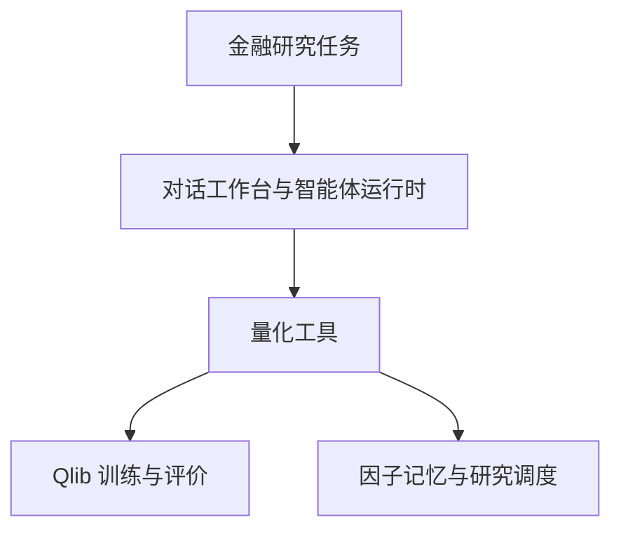

# BenjaminAgent

**把金融研究问题变成可追溯因子实验的研究工作台。**

[English](README.md) · [从这里开始](docs/zh/learning-path.md) · [本地运行](docs/zh/run-guide.md) · [参与贡献](CONTRIBUTING.zh-CN.md)

BenjaminAgent 将流式研究界面、LangGraph 智能体运行时、Qlib 评估与实验性的因子知识管理连接起来，基于 [DeerFlow](https://github.com/bytedance/deer-flow) 和 [Qlib](https://github.com/microsoft/qlib) 构建。当前训练路径使用 **LightGBM**。项目处于实现与验证阶段，提供对应真实源码的教程和明确的验证任务。

## 架构概览



图示为现有组件与数据关系，[实现状态](docs/zh/status.md)列出仍需贯通编排的生命周期阶段。

## 你可以学到什么、完成什么

- 从聊天界面追踪一次请求，直到工具调用和 Qlib 实验。
- 用清晰定义区分因子质量、预测质量与组合表现。
- 理解因子血缘、检索、准入与调度之间的关系。
- 提交一个小型复现、数据契约测试或有依据的实现审阅。

教程使用可以手算的小例子。示例数字用于讲解；研究结果需要附上[状态清单](docs/zh/status.md)中规定的证据。

## 项目导航

| 主线 | 现有材料 | 下一项交付 | 实际状态 |
|---|---|---|---|
| 理解系统 | [架构](docs/zh/architecture.md)、[学习路径](docs/zh/learning-path.md) | 一次完整请求及保存的工具事件 | 已有源码导读 |
| 评估基线 | [案例一：任务到回测](docs/zh/case-01-task-to-backtest.md)及 Qlib 管道 | 固定数据区间、可复现的 LightGBM 实验 | 已有代码，待集成运行验证 |
| 研究因子演化 | [案例二：因子生命周期](docs/zh/case-02-factor-lifecycle.md) | 基于实际因子向量的多样性指标及生命周期测试 | 已有实验组件 |
| 复现与维护 | [运行指南](docs/zh/run-guide.md)、[路线图](docs/zh/roadmap.md) | 版本化环境与实验凭据包 | 正在完善本地验证 |

## 两个贯通案例

**[一：用户任务如何成为基线实验](docs/zh/case-01-task-to-backtest.md)。** 沿着界面、数据流、工具配置、会话、时间划分、LightGBM 训练、IC 计算和组合报告逐步阅读，用三只股票的相关系数和年化计算理解指标。

**[二：因子如何成为可复用的研究知识](docs/zh/case-02-factor-lifecycle.md)。** 从动量假设出发，经过公式与代码、格式检查、DAG 血缘、检索打分、准入规则和九维 Bandit 状态。先手算选择与准入，再核查实现边界。

## 第一次贡献

1. 阅读一个案例，选择一条附有源码链接的表述。
2. 记录符号、输入、输出，以及一个最小例子。
3. 将例子与实现对照，写出预期行为和实际行为。
4. 创建 Issue，确认任务范围，再提交附有证据记录的聚焦 PR。

| 入门任务 | 建议位置 | 验收证据 | 认领状态 |
|---|---|---|---|
| 复核 IC 与收益定义 | `docs/zh/case-01-task-to-backtest.md`及英文对应页 | 手算例子与精确函数引用 | 待认领 |
| 复现 DAG 序列化 | `backend/tests/` | 覆盖父子关系和指标字段的往返测试 | 待认领 |
| 解释一次检索得分 | `docs/zh/case-02-factor-lifecycle.md`及英文对应页 | 与无网络小样本一致的手算过程 | 待认领 |

[贡献指南](CONTRIBUTING.zh-CN.md)提供证据记录模板与审阅流程。先选择范围明确的小任务；只有相应执行路径需要训练数据或外部模型凭据。

## 目录结构

```text
frontend/                       流式研究工作台
backend/app/                    网关 API
backend/packages/harness/       智能体运行时与量化工具
third_party/                    依赖来源与许可声明
scripts/                        本地配置与服务启动工具
docker/                         服务和代理配置
skills/                         上游运行时技能
docs/en/ 与 docs/zh/             对应的中英文教程和项目文档
```

目录和历史仓库名沿用 `Fintelligence`，对外展示名称为 **BenjaminAgent**。历史文稿命名和源码来源见[来源与研究脉络](docs/zh/sources.md)。

## 当前研究边界

基线管道已包含模型训练、预测、IC 评估和组合评估代码。因子生成、DAG、检索、准入及 Bandit 模块已经存在，模块集成与指标口径仍有待验证。尤其是 `run_mining_loop` 当前执行调度和检索，完整生命周期仍需编排与核验。解释任何实验输出前，请先核对[状态清单](docs/zh/status.md)。

## 分工、维护与许可

参见[角色分工](docs/zh/roles.md)、[路线图](docs/zh/roadmap.md)和[第三方声明](THIRD_PARTY_NOTICES.md)。上游代码和原创代码适用相应的 [MIT 许可](LICENSE)。原创项目文档采用 [CC BY-NC-SA 4.0](LICENSE-DOCS)，第三方文档保持其原有条款。教程借鉴 Datawhale 项目的学习组织方式；组织参与或背书以已确认信息为准。
