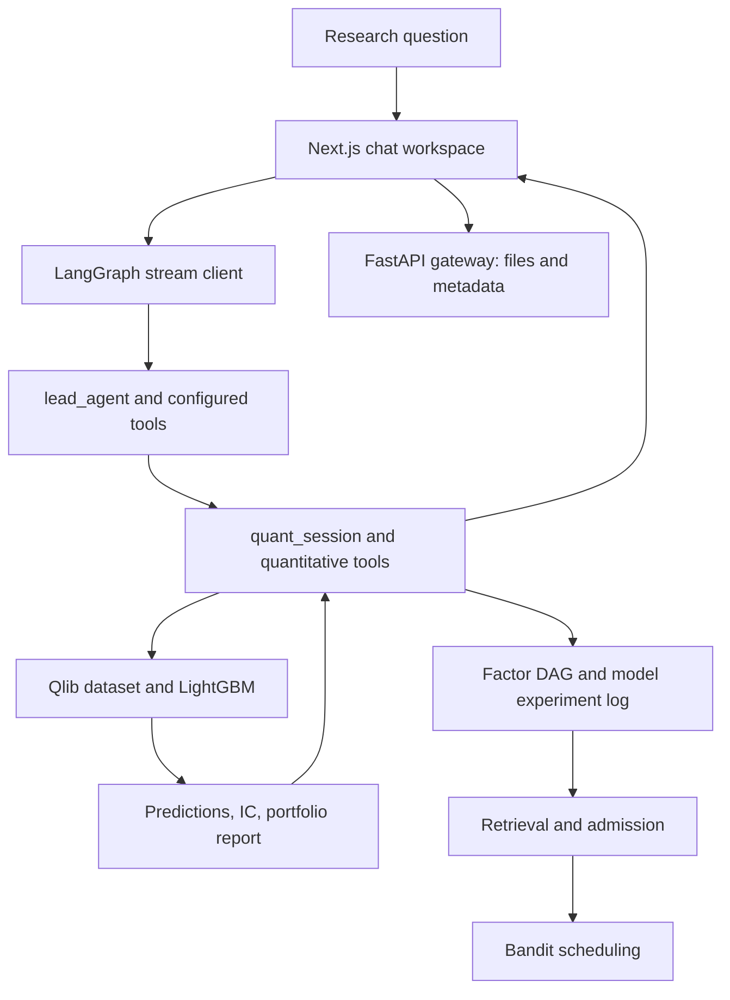

# Architecture and data contracts

[Home](../../README.md) · [中文](../zh/architecture.md)

BenjaminAgent has an interaction layer, an orchestration layer, and a quantitative execution layer. The framework retains upstream module names so imports and build tooling remain traceable.

The diagram describes available components and intended data relationships. It does not imply that the mining convenience action executes every edge in one call; [status](status.md) gives the integration boundary.

| Boundary | Concrete source | Data crossing it |
|---|---|---|
| Chat → stream | [hooks.ts](../../frontend/src/core/threads/hooks.ts) | Human message, thread ID, runtime context |
| Stream → graph | [api-client.ts](../../frontend/src/core/api/api-client.ts), [langgraph.json](../../backend/langgraph.json) | `lead_agent` run and incremental events |
| Agent → tools | [tools.py](../../backend/packages/harness/deerflow/tools/tools.py), [config example](../../config.example.yaml) | Resolved tool object and validated arguments |
| Tool → session | [thread_state.py](../../backend/packages/harness/deerflow/agents/thread_state.py), [quant_analyze_tool.py](../../backend/packages/harness/deerflow/tools/builtins/quant/quant_analyze_tool.py) | Configuration, history, metrics, DAG state |
| Session → experiment | [qlib_pipeline.py](../../backend/packages/harness/deerflow/tools/builtins/quant/qlib_pipeline.py) | Dataset, train/validation/test segments, model and strategy parameters |
| Factor → knowledge | [knowledge_graph.py](../../backend/packages/harness/deerflow/tools/builtins/quant/dag/knowledge_graph.py) | Formula, code, ancestry, measurements, feedback |

## Contracts to inspect

A factor output is a single-column pandas DataFrame with a two-level `(datetime, instrument)` index. A prediction aligns with the test label index before daily cross-sectional correlation. A session holds configuration separately from human-readable messages; the message alone is insufficient to reproduce a run. A DAG node contains both formula and code, plus provenance and measured quality.

The frontend consumes tool events and state updates; it does not implement Qlib training in the browser. The FastAPI gateway provides related APIs while the default streaming run is served by LangGraph. The local reverse proxy routes both under one browser origin.

## Review question

Where should you look if the chat says an experiment completed but no portfolio metrics are present?

**Answer.** Follow the tool update into `run_full_pipeline` and `_calc_backtest_metrics`. Missing benchmark data can leave an IC-only result. Check the structured metrics and log before changing the UI or interpreting absent metrics as zero.
