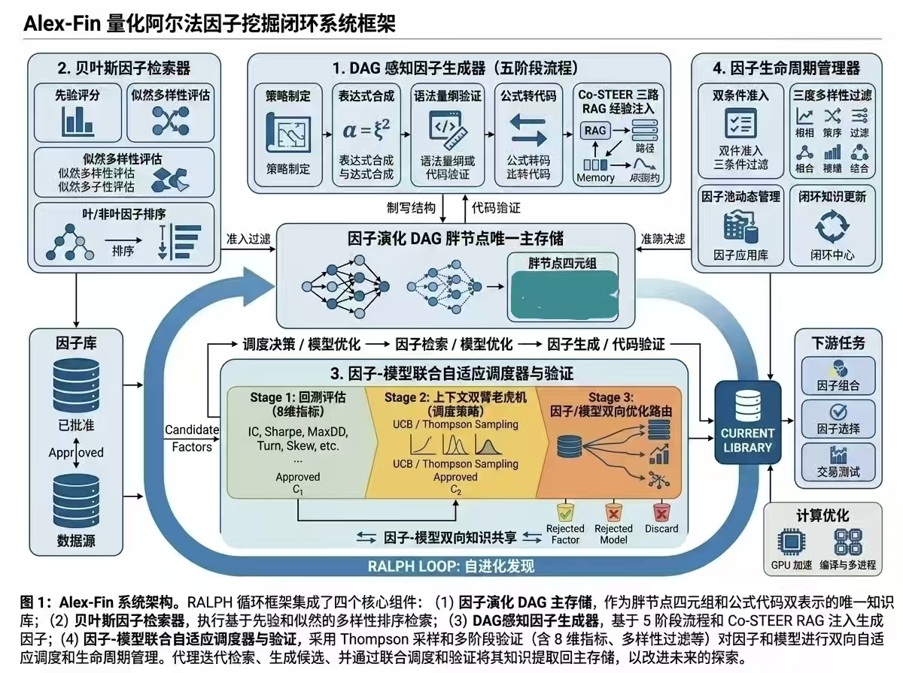

# 架构与数据契约

[首页](../../README_zh.md) · [English](../en/architecture.md)

BenjaminAgent 包含交互层、编排层和量化执行层。框架沿用上游模块名，使导入关系与构建工具保持可追溯。

*原稿图 2「Alex-Fin架构图」。原始方法图呈现历史八阶段研究闭环与八维调度设计。当前源码采用九维状态，各阶段由不同处理器实现。[图片来源](../assets/manuscript/README.md)记录保持原样的图片文件。*

从研究问题向外阅读：任务需要配置与数据，测量值说明因子是否有用，图保存尝试过的想法，检索为下一次提案提供上下文，准入管理活跃池，调度分配下一步研究工作。这解释了方法所期望的反馈闭环。[完整文稿](https://github.com/Soros2040/julius-future/blob/main/works/benjamin-agent/manuscript.md)进一步阐述动机与公式；下表将这些想法映射到当前实现边界，[状态清单](status.md)记录仍需完成的集成工作。

| 边界 | 对应源码 | 经过的数据 |
|---|---|---|
| 聊天 → 数据流 | [hooks.ts](../../frontend/src/core/threads/hooks.ts) | 用户消息、任务 ID、运行上下文 |
| 数据流 → 图 | [api-client.ts](../../frontend/src/core/api/api-client.ts)、[langgraph.json](../../backend/langgraph.json) | `lead_agent` 运行及增量事件 |
| 智能体 → 工具 | [tools.py](../../backend/packages/harness/deerflow/tools/tools.py)、[配置样例](../../config.example.yaml) | 解析后的工具对象与参数 |
| 工具 → 会话 | [thread_state.py](../../backend/packages/harness/deerflow/agents/thread_state.py)、[quant_analyze_tool.py](../../backend/packages/harness/deerflow/tools/builtins/quant/quant_analyze_tool.py) | 配置、历史、指标及 DAG 状态 |
| 会话 → 实验 | [qlib_pipeline.py](../../backend/packages/harness/deerflow/tools/builtins/quant/qlib_pipeline.py) | 数据集、训练/验证/测试段、模型和策略参数 |
| 因子 → 知识 | [knowledge_graph.py](../../backend/packages/harness/deerflow/tools/builtins/quant/dag/knowledge_graph.py) | 公式、代码、血缘、测量值及反馈 |

## 需要检查的契约

因子输出为单列 pandas DataFrame，索引为 `(datetime, instrument)` 两层。预测值在计算每日截面相关系数前，与测试标签索引对齐。会话将配置和可读消息分别保存，单凭回复文字不足以复现实验。DAG 节点同时记录公式与代码，并保存来源和质量测量。

前端消费工具事件和状态更新，Qlib 训练在服务端执行。FastAPI 网关提供相关 API，默认流式运行由 LangGraph 服务承担；本地反向代理将两者映射到同一浏览器源。

## 结合实现阅读原始路线图

*原稿图 1「技术路线图」，保留历史名称、阈值与八维调度背景。当前指标定义与阈值分别见[案例一](case-01-task-to-backtest.md)和[案例二](case-02-factor-lifecycle.md)。该图是研究设计来源；证明完整生命周期已运行，需要相应证据包。*

文稿把 DAG 视为核心研究记忆对象。当前代码还包含独立的模型实验日志，因子节点序列化保存 IC 系列指标，但没有声明组合指标字段。要判断后续决策是否能够恢复此前全部证据，需要同时追踪这两条存储路径。同样，`run_mining_loop` 当前进行调度与检索，其余阶段处理器仍需显式编排，才能构成完整闭环。

## 检查题

聊天显示实验完成，但没有组合指标，应从哪里排查？

**答案。** 从工具状态更新追踪到 `run_full_pipeline` 和 `_calc_backtest_metrics`。基准数据缺失时可能只返回 IC 结果。先核对结构化指标和日志，再决定是否修改界面；缺失指标不能按零解释。
